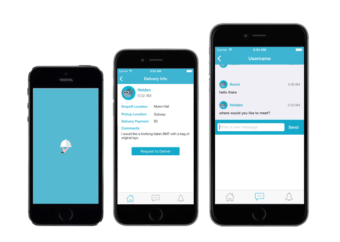

GetGrub
=======

GetGrub is a mobile and web application which aims at providing busy college students with a simple means of acquiring food from various locations.
The app allows users to post adds explaining their needs or cravings for food, respond to and discuss adds, and actually follow through with deliveries:

This project's backend is powered by [Parse](http://parse.com), which made bridging the gap between mobile and web platforms very easy.
The mobile app portion of the project was entirely written in [Swift](http://developer.apple.com/swift/), and the web portion was written in the html, css, and javascript, making some use of [backbone.js](backbonejs.org).

This was a great experience for us, because none of us new javascript beforehand.
Overall, we all learned a lot from this project and we are very proud of our work.
We hope you enjoy it as much as we do!

Build Instructions
------------------

Static files for the web frontend are served by [Warp](htps://hackage.haskell.org/pacakge/warp), an implementation of the [Haskell Web Application Interface](https://hackage.haskell.org/package/wai).
The easiest way to build this server (for Linux or Mac) is with the [Nix Package Manager](nixos.org).
Simply [install Nix](nixos.org/nixos/download.html), and run `nix-build` in the `web` directory.
To deploy, run `./result/bin/serve [PORT] [BASE_DIR]`, where `BASE-DIR` is the absolute path of the `web/static` directory.
